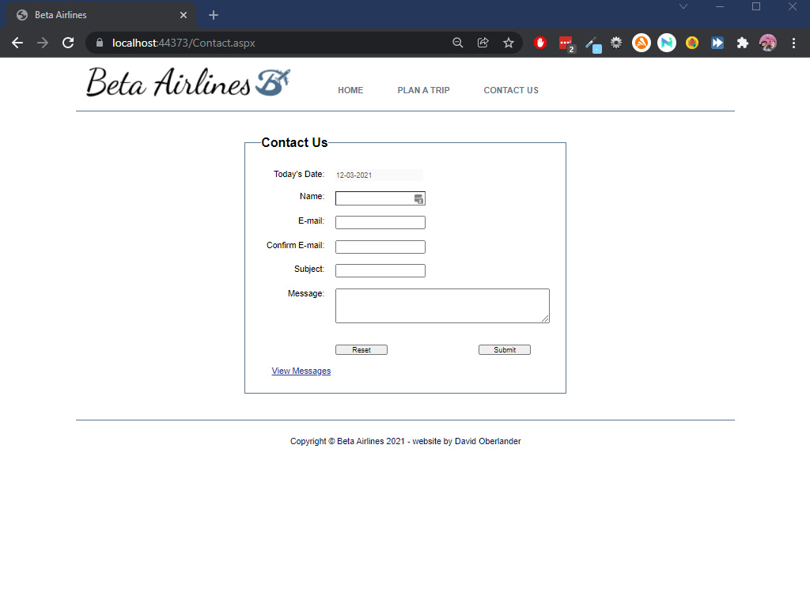

<h1>Beta Airlines</h1>
This website was created using C# on the ASP.NET framework, taking advantage of WebForms.  
This connects to an SQL Lite database that stores the contact messages, and I created a quick page to manage those messages.  
<h3>Plan a Trip</h3>

<h3>Contact Us</h3>

<h3>Manage the Messages</h3>

